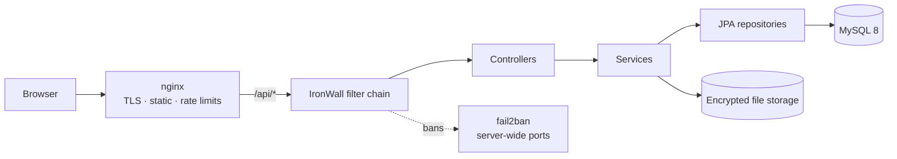

<div align="center">


# Classic Cloud

**A self-hosted cloud drive that ships with its own WAF.**

[](../../releases)
[](LICENSE)
[](../../stargazers)
[](https://openjdk.org/)
[](https://spring.io/projects/spring-boot)
[](https://vuejs.org/)
[](https://www.mysql.com/)

[中文](README.md) · **English**

</div>

---

## What it is

A full private cloud drive you host yourself: file tree, drag-and-drop upload,
resumable chunked uploads, password + expiry + download-cap share links,
in-browser preview, recycle bin, device management, TOTP 2FA, and AES-256-GCM
encryption at rest. Nothing goes through a third party.

What makes it different: **the web application firewall is inside the app, not
bolted on afterwards.** If you have ever exposed a service to the internet, you
know the scanner traffic. Classic Cloud turns that traffic into bans.

## Features

| Area | What you get |
| :--- | :--- |
| **Files** | Multi-level folders, drag-and-drop, batch move/copy/delete, recycle bin, resumable chunked upload, large-file streaming |
| **Sharing** | Public share links with password, expiry and download limit; signed links; in-browser preview for images, video, audio, documents |
| **Accounts** | Registration, email verification, TOTP two-factor, device list, forced logout on password change (token versioning) |
| **Storage** | AES-256-GCM encryption at rest with a master key file you hold |
| **Admin** | User management, quota, announcements, attack dashboard, ban list, appeal review |
| **Security** | IronWall engine: 49 components, attack detection, active defence, ban pipeline |

## The IronWall security engine

| Layer | What it does |
| :--- | :--- |
| **Detection** | SQL injection (UNION / time-based / `information_schema` / always-true), command injection, XSS, path traversal, SSRF, scanner fingerprints (sqlmap / nikto / nmap / burp), crawler user agents |
| **Deception** | Honeypot paths, honeypot login accounts, decoy ports (7 layers × 3 rotating ports), tarpit slow responses |
| **Correlation** | Per-IP scoring with decay, `/24` subnet bans, ASN / carrier egress circuit breaker, device and TLS/JA4 fingerprint clustering, campaign detection |
| **Response** | Blocked-IP page, JSON error envelope, ban sync to `fail2ban` so the block escalates from the web layer to **server-wide port blocking** |
| **Recovery** | Human-verification appeal flow so a false positive can be lifted without shell access |

The security layer is decoupled from business code: adding a new endpoint does
not require touching the security components.

## Architecture



Filter chain order (from `SecurityConfig.java`):
`SecurityHeaders → BlockedIpPage → Trap → RateLimit → ApiCrypto → AttackAlert →
CrawlerDefense → Tarpit → JwtAuthentication → UserRateLimit → AccountDeviceTracker → Controller`

## Tech stack

| Layer | Technology |
| :--- | :--- |
| Backend | Java 21, Spring Boot 3.3.5, Spring Security, Spring Data JPA, JJWT |
| Frontend | Vue 3, TypeScript, Vite 5, Pinia, Tailwind CSS |
| Database | MySQL 8 (schema in `backend/src/main/resources/db/init.sql`) |
| Gateway | nginx 1.20+ (reverse proxy, optional JA4 fingerprint module) |
| Deployment | BaoTa (aaPanel) panel or systemd; see the Chinese deployment guide |

## Project layout

```
├─ backend/          Spring Boot app  (API + IronWall security engine)
│  ├─ src/main/      controllers, services, repositories, security/, dto/
│  ├─ config/        ironwall-rules.sample.json
│  ├─ deploy/        nginx templates, logrotate, JA4 module
│  └─ server-guard/  host-level hardening scripts
├─ frontend/         Vue 3 + TypeScript SPA
└─ 宝塔面板部署教程.md  step-by-step manual deployment guide (Chinese)
```

## Manual deployment

Build it yourself if you prefer:

```bash
cd backend && mvn clean package -DskipTests        # -> target/jdy-cloud.jar
cd ../frontend && npm install && npm run build      # -> dist/
mysql -u root -p < ../backend/src/main/resources/db/init.sql
```

Then fill in `SITE_DOMAIN`, `DB_URL` / `DB_USERNAME` / `DB_PASSWORD`,
`JWT_SECRET` and the `ADMIN_*` values (see `backend/.env.example`). The app
refuses to start without them on purpose.

## License

[PolyForm Noncommercial License 1.0.0](LICENSE) — free for personal, educational
and non-profit use. Commercial use requires a separate license; open an issue to
talk about it.

## Contributing

Issues and pull requests are welcome — especially **attack payloads that slip
through the detection rules**. If you can reproduce a bypass, send it in and it
gets a rule.
