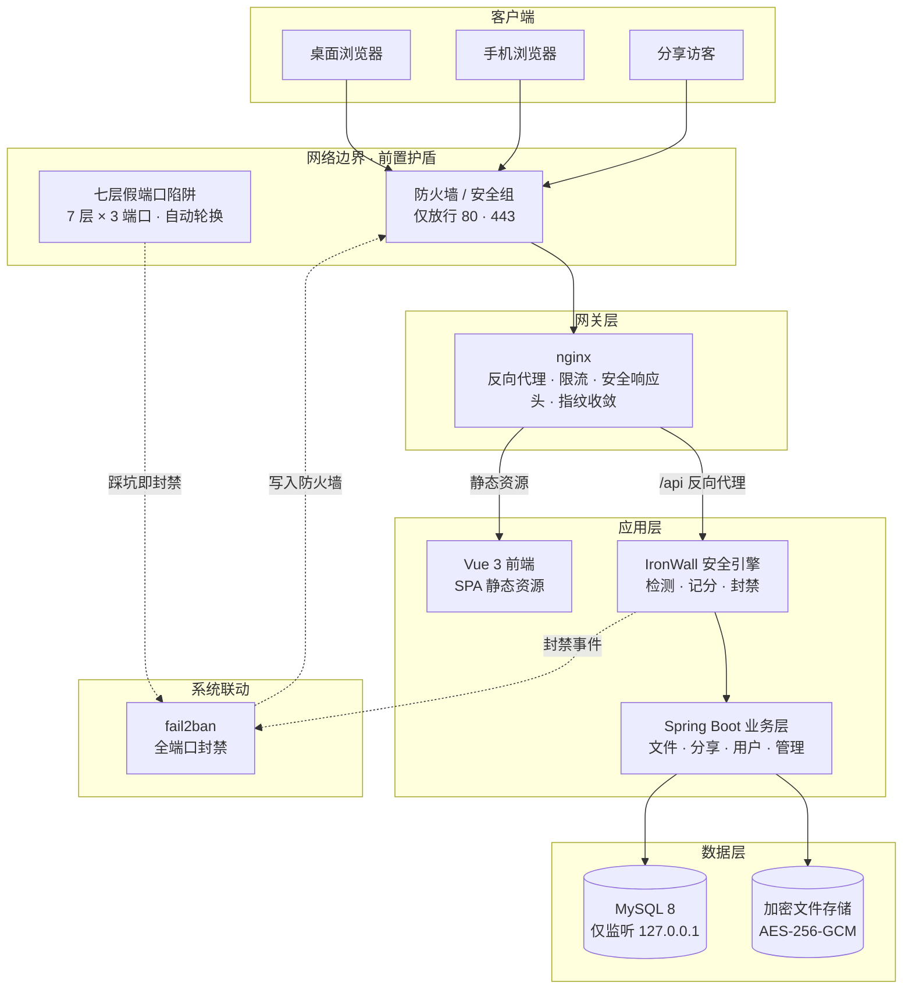
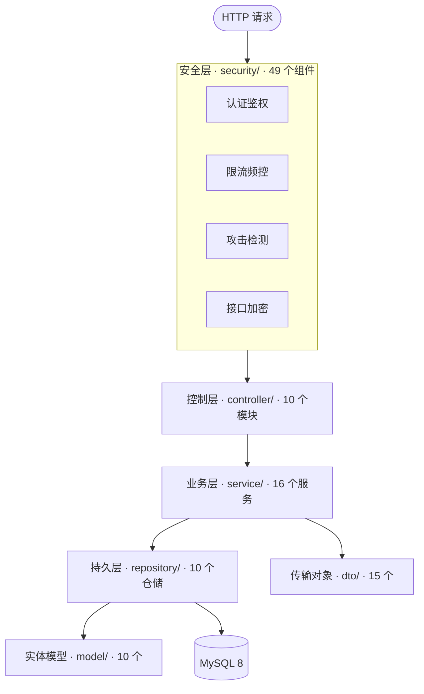
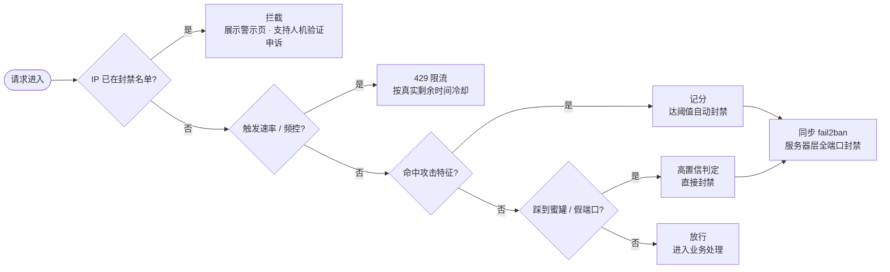

<div align="center">


# 经典云网盘

**轻量 · 安全 · 自主可控的私有云盘系统**

后端 Spring Boot + MySQL　·　前端 Vue 3 + Vite　·　内置 IronWall 铁壁安全引擎

[](LICENSE)
[](../../releases)
[](https://openjdk.org/)
[](https://spring.io/projects/spring-boot)
[](https://vuejs.org/)
[](https://www.mysql.com/)
[](https://nginx.org/)

[功能特性](#功能特性)　·　[快速开始](#快速开始)　·　[宝塔部署教程](宝塔面板部署教程.md)　·　[安全引擎](#安全引擎)　·　[许可证](#许可证)

</div>

---

## 这是什么

一套可以完全自建的私有云盘。上传、下载、分享、在线预览全都自己说了算，
数据落在你自己的服务器上，不经过任何第三方。

本仓库是**完整源码**。站点身份、数据库与密钥等配置**全部由部署者通过环境变量提供**——
按要求填写后站点才能跑起来，不填不会启动，这是有意为之。

> **第一次部署？** 照着 [宝塔面板部署教程](宝塔面板部署教程.md) 做，
> 全程复制粘贴，约 20 分钟上线。

---

## 功能特性

| | 能力 |
| :--- | :--- |
| 📁 **文件管理** | 多级文件夹、拖拽上传、批量操作、回收站与恢复 |
| ⚡ **断点续传** | 大文件分片上传，中断后自动续传，不用从头再来 |
| 🔗 **公开分享** | 链接分享、密码保护、有效期与下载次数限制 |
| 👁 **在线预览** | 图片、文档、音视频免下载直接看 |
| 👤 **个人中心** | 存储用量、下载统计、设备管理、通知设置 |
| 🛡 **安全防护** | IronWall 铁壁安全引擎，七层防护全天候守护 |
| 🔐 **两步验证** | TOTP 动态口令，账号多一道锁 |
| 📱 **多端适配** | 桌面端与移动端自适应 |
| 🗄 **存储加密** | 上传文件 AES-256-GCM 静态加密 |

---

## 技术栈

| 层 | 技术 |
| :--- | :--- |
| **后端** | Java 21 · Spring Boot 3.3 · Spring Security · Spring Data JPA |
| **前端** | Vue 3 · TypeScript · Vite · Pinia · Vue Router |
| **存储** | MySQL 8 · 本地文件系统（AES-256-GCM 加密） |
| **网关** | nginx（反向代理、限流、安全响应头、SPA 回退） |
| **安全** | IronWall 安全引擎 · fail2ban 联动 · 防火墙端口收敛 |

---

## 架构

### 整体部署



一句话概括数据流：**客户端 → 防火墙 → nginx → IronWall 检测 → 业务层 → 加密落盘**。
安全引擎夹在网关与业务之间，攻击在触及业务代码之前就被拦下。

### 后端分层



请求先过安全层，再进业务代码。两层完全解耦——新增接口不用动安全代码，防护默认生效。

---

## 快速开始

### 环境要求

| 组件 | 版本 | 用途 |
| :--- | :--- | :--- |
| **JDK** | 21 | 运行后端 |
| **MySQL** | 8.x | 数据存储 |
| **Node.js** | 18+ | 构建前端 |
| **nginx** | 1.20+ | 生产反向代理（可选） |

### 三步跑起来

```bash
# 1. 构建后端
cd backend
mvn clean package -DskipTests          # 产物：target/jdy-cloud.jar
cp start.sh.example start.sh           # 启动脚本
cp config/ironwall-rules.sample.json config/ironwall-rules.json

# 2. 构建前端
cd ../frontend
cp .env.example .env.local             # 填写站点名称、域名、联系邮箱
npm install && npm run build           # 产物：dist/

# 3. 初始化数据库并启动
mysql -u root -p < ../backend/src/main/resources/db/init.sql
cd ../backend
chmod +x start.sh && ./start.sh
```

### 启动前必须填的四项

编辑 `backend/start.sh`，把这四项换成你自己的值。**任何一项没填，脚本会拒绝启动**：

| 变量 | 说明 |
| :--- | :--- |
| `DB_USERNAME` / `DB_PASSWORD` | 数据库账号密码 |
| `JWT_SECRET` | 登录签名密钥，用 `openssl rand -hex 32` 生成，少于 32 位会被拒绝 |
| `SITE_DOMAIN` | 你的域名，**不含** `https://` 与结尾斜杠 |
| `ADMIN_USERNAME` / `ADMIN_PASSWORD` / `ADMIN_EMAIL` | 首个管理员；库中没有管理员时自动创建，已有则不改动 |

> `backend/.env.example` 是**字段对照表，程序不会读取它**。
> 真正生效的是 `start.sh` 里的 `export`——改配置请改 `start.sh`。

### 验证

```bash
curl -s http://127.0.0.1:15060/api/version/info
```

```json
{"success":true,"message":"操作成功","data":{"current_version":"v1.48.0","changelog":[]}}
```

> 后端默认只监听 `127.0.0.1`，外部访问一律走 nginx 反代，**不需要在防火墙放行后端端口**。

---

## 部署

- 📘 **[宝塔面板部署教程](宝塔面板部署教程.md)** —— 面向新手，含反向代理、SSL、加固与排错
- 📄 [`backend/deploy/`](backend/deploy/) —— nginx 配置模板、日志轮转、JA4 指纹模块
- 🛡 [`backend/server-guard/`](backend/server-guard/) —— 服务器层加固脚本与联动配置

模板里的域名与 IP 都是保留值（`example.com`、`203.0.113.x`），**使用前请替换成你自己的**：

```bash
grep -rl "example.com" backend/deploy | xargs sed -i 's/example\.com/你的域名/g'
```

---

## 项目结构

```
├─ backend/                  后端（Java 21 / Spring Boot）
│  ├─ src/main/              主程序：接口、业务、安全引擎
│  ├─ src/test/              单元测试与安全回归用例
│  ├─ config/                安全引擎规则（样例）
│  ├─ deploy/                nginx / logrotate 部署模板
│  ├─ server-guard/          服务器层加固与联动脚本
│  ├─ security-tests/        黑盒安全回归测试
│  ├─ .env.example           环境变量模板
│  ├─ start.sh.example       启动脚本模板
│  └─ pom.xml                构建描述
│
├─ frontend/                 前端（Vue 3 / TypeScript / Vite）
│  ├─ src/                   页面、组件、状态管理、国际化
│  ├─ public/                静态资源与站点图标
│  ├─ scripts/               构建期脚本
│  ├─ .env.example           环境变量模板
│  └─ package.json           构建描述
│
├─ 宝塔面板部署教程.md        新手部署全流程（含反向代理、SSL、加固）
│
└─ .github/workflows/        持续集成：安全门禁与供应链扫描
```

以下内容**不包含**在本仓库中，且已被 `.gitignore` 排除：
本地配置与凭据（`.env` / `start.sh`）、安全规则实文件、
构建产物（`target/` `dist/`）、依赖目录与本地工具脚本。

---

## 配置说明

### 安全引擎规则

检测规则放在 `config/ironwall-rules.json`，与程序分离部署，调整策略无需重新打包。

- 该文件已被 `.gitignore` 排除，仓库只提供 `ironwall-rules.sample.json` 作为基线。
- 缺失时启动日志会列出尚未配置的条目，对应检测族自动退化为「永不匹配」，不会让服务崩溃。
- 路径可用环境变量 `IRONWALL_RULES_FILE` 指定。

### 假端口陷阱

七层假端口陷阱默认只避开常见服务端口。你若用了自定义的管理面板或 SSH 端口，
把清单填进 `IRONWALL_RESERVED_PORTS`（逗号分隔），诱饵端口就会绕开它们：

- **后端侧**：`start.sh`，影响管理面板显示的端口清单。
- **服务器侧**：`/etc/systemd/system/ironwall-decoy.service` 的
  `Environment="IRONWALL_RESERVED_PORTS=888,22022"`——**这才是真正开端口的地方**。
  改完执行 `systemctl daemon-reload && systemctl restart ironwall-decoy.service`。

### 前端变量

见 `frontend/.env.example`。`VITE_API_BASE_URL` 仅本地开发用，生产由 nginx 反代 `/api`，无需配置。

---

## 安全引擎

内置**铁壁安全引擎（IronWall）**。它不是挂在门口的一个插件，而是一整套贯穿
网络边界 → 网关 → 应用 → 存储的防护体系：**五层前置护盾 + 主动防御威慑**，开箱即用。

nginx、fail2ban、防火墙、SSH、MySQL 这些服务器层组件由
[`backend/server-guard/`](backend/server-guard/) 里的脚本一键接入，
装完管理后台的「安全预警」面板会实时点亮。

### 五层前置护盾

| 层 | 名称 | 做什么 |
| :--- | :--- | :--- |
| **L1** | **入口收敛** | 防火墙只放行 80 / 443；管理面板与 SSH 绑定白名单 IP，其余端口不给出口 |
| **L2** | **铁壁引擎** | nginx 反向代理 + IronWall 网站层攻击检测，命中即记分，达阈值即封禁 |
| **L3** | **系统联动** | 网站层封禁自动写入 fail2ban，升级为**服务器层全端口封禁**，不是只封 80/443 |
| **L4** | **服务加固** | SSH 密钥登录、MySQL 仅内网监听，核心服务不暴露公网 |
| **L5** | **数据保全** | 目录防篡改校验 + 数据库与文件自动备份 |

### 请求防护链路



### 攻击检测能力

| 类别 | 覆盖内容 |
| :--- | :--- |
| **注入类** | SQL 注入（联合查询 / 时间盲注 / information_schema / 注释截断 / 恒真条件）、命令注入 |
| **脚本类** | XSS（script · img · svg · iframe · 事件属性 · javascript: 伪协议） |
| **路径类** | 目录穿越（`../` 及多重编码变体）、系统文件探测、可疑后缀走私 |
| **协议层** | SSRF（file / gopher / dict / 内网地址探测） |
| **自动化** | 扫描器指纹（sqlmap · nikto · nmap · burp 等）、爬虫 UA（curl · wget · python-requests · 无头浏览器） |

> 规则与代码分离，放在 `config/ironwall-rules.json`，调整策略无需重新打包。
> 引擎还支持更多检测族（运算符变体、编码绕过、Unicode 混淆、双写关键词等），
> 缺失项会在启动日志中逐条列出，按自己的业务补进去即可。

### 主动防御与威慑

| 能力 | 说明 |
| :--- | :--- |
| **蜜罐诱捕** | 仿真敏感路径，触碰即判定为高置信攻击 |
| **蜜标账号** | 真实用户绝不可能提交的账号名，一旦被登录即判攻击 |
| **Tarpit 拖延** | 对持续攻击者慢响应消耗，拖住扫描与爆破 |
| **假端口陷阱** | 7 层 × 3 个随机端口，只有入口没有出口，踩中即全端口封禁 |
| **端口扫描检测** | 自动识别探测源并封禁整个来源 |
| **IP 段封禁** | 顽固攻击者按 /24 网段整体封禁 |
| **移动出口熔断** | 运营商出口级别封禁，带时长上限与豁免机制 |
| **用户级限速** | 已认证用户超限单独拦截，不与匿名流量混算 |
| **威胁情报** | 攻击者溯源取证、滥用报告与多实例封禁同步 |
| **人机验证申诉** | 被误封的正常用户可通过验证自助解封，避免误伤 |

### 数据与账号安全

| 能力 | 说明 |
| :--- | :--- |
| **存储加密** | 上传文件 AES-256-GCM 静态加密，密钥独立于代码 |
| **接口签名** | 分享链接签名校验，路由码定时轮换 |
| **设备指纹** | 登录设备识别与异常聚合检测 |
| **两步验证** | TOTP 动态口令 |
| **上传准入** | 后缀白名单 + 多扩展名走私拦截 + 文件内容安全扫描 |
| **审计告警** | 关键操作留痕，异常事件实时告警 |

安全回归用例见 [`backend/security-tests/`](backend/security-tests/) 与 CI 门禁。

---

## 升级

```bash
mvn clean package -DskipTests
```

替换 `target/jdy-cloud.jar` 后重启 `./start.sh` 即可。
脚本自带端口占用保护与健康自检，并会在自检期间挂维护标识，避免重启窗口被探测。

---

## 常见问题

启动失败、大文件上传 413、反向代理 404/502、开机自启、换域名等问题，
见 [宝塔面板部署教程 · 常见问题](宝塔面板部署教程.md#八常见问题)。

---

## 许可证

本项目采用 **PolyForm 非商用许可 1.0.0**（PolyForm Noncommercial License 1.0.0），详见 [LICENSE](LICENSE)。

Copyright © 2026 经典云网盘 (Classic Cloud)

| | 说明 |
| :--- | :--- |
| ✅ **个人使用免费** | 学习、研究、实验、个人项目、业余折腾，随便用 |
| ✅ **非营利机构免费** | 学校、公益组织、科研机构、政府单位，免费使用 |
| ✅ **可以自由修改** | 想怎么改就怎么改，做二次开发也没问题 |
| ✅ **可以分发** | 可以分享给别人，但要带上这份许可与版权声明 |
| ❌ **不能商用** | 任何以盈利为目的的使用，都需要单独获得授权 |
| ❌ **不能闭源转售** | 改个名字打包成闭源产品出售，是不允许的 |

> **需要商业授权？** 到仓库 [Issues](../../issues) 说明你的用途，我们再谈。
> 软件按「原样」提供，不附带任何担保。

---

<div align="center">

<sub>© 2026 经典云网盘 Classic Cloud</sub>

</div>
