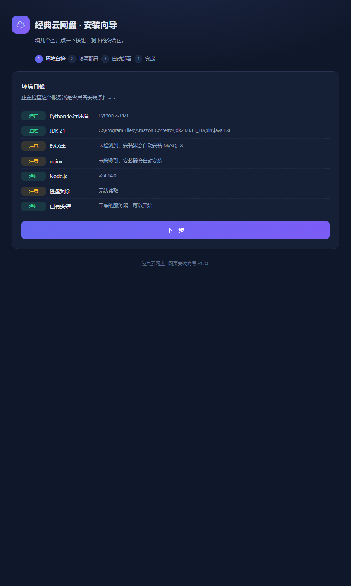
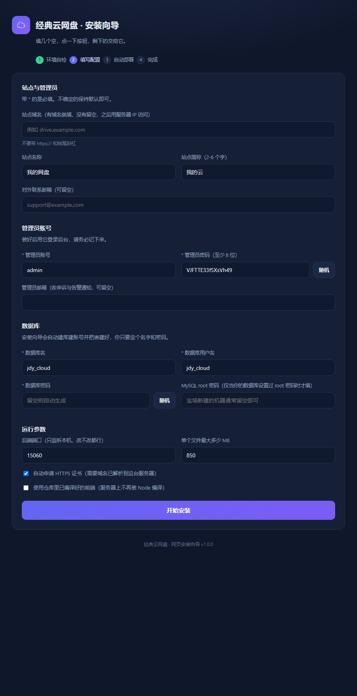
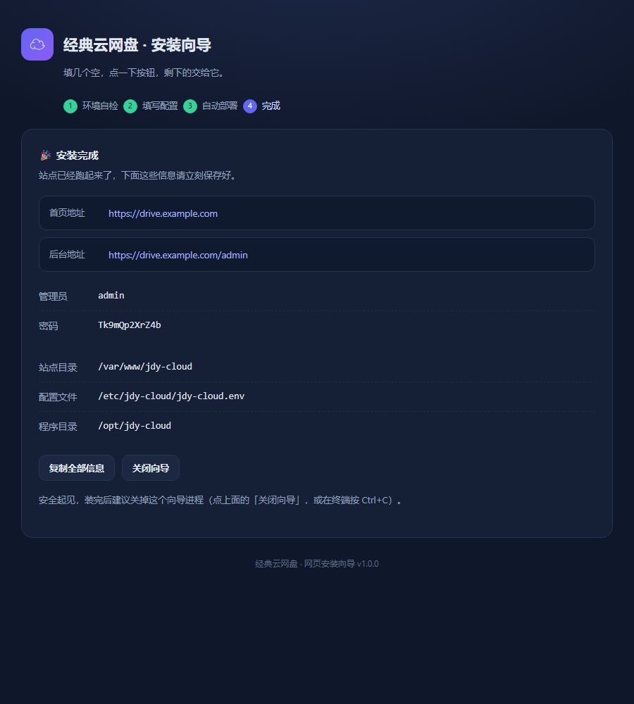
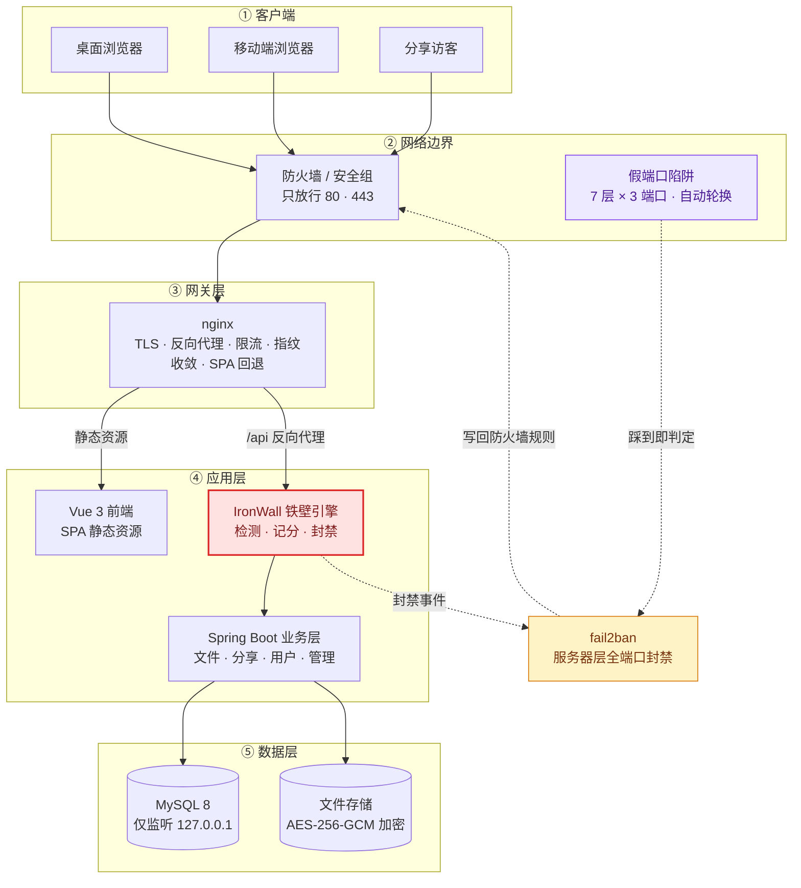
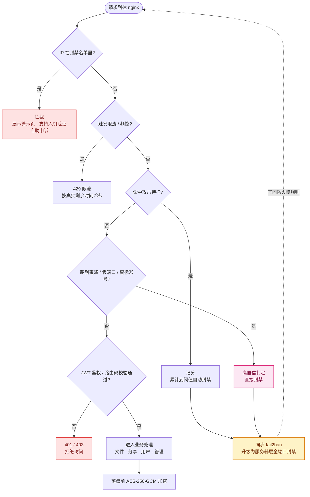
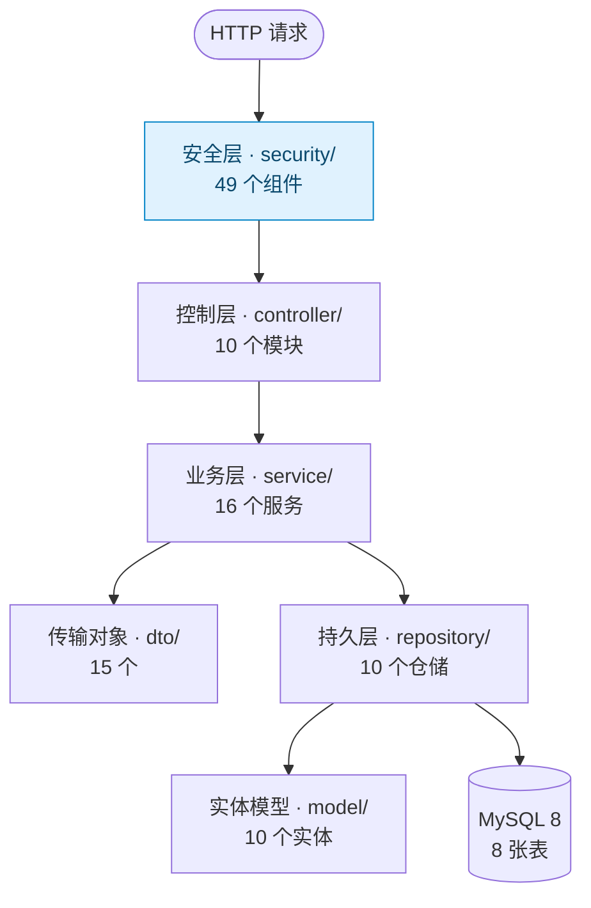

<div align="center">


# 经典云网盘

**把网盘装进自己的服务器，数据一寸都不外流**

后端 Spring Boot + MySQL　·　前端 Vue 3 + Vite　·　内置 IronWall 铁壁安全引擎

[](../../releases)
[](LICENSE)
[](../../stargazers)
[](../../forks)
[](../../issues)

[](https://openjdk.org/)
[](https://spring.io/projects/spring-boot)
[](https://vuejs.org/)
[](https://www.typescriptlang.org/)
[](https://www.mysql.com/)
[](https://nginx.org/)

[功能特性](#功能特性)　·　[系统架构](#系统架构)　·　[安全引擎](#安全引擎)　·　[快速开始](#快速开始)　·　[部署](#部署)　·　[宝塔部署教程](宝塔面板部署教程.md)　·　[许可证](#许可证)

**中文** · [English](README.en.md)

</div>

---

## 这是什么

一套**可以完全自建的私有云盘**。

你把它装在自己的服务器上——上传的文件、生成的分享链接、用户数据、访问日志，**从头到尾不经过任何第三方**。没有容量套餐，没有限速会员，也没有「你的文件我们有权审查」。

它不只是一个网盘前端配个后端。里面还塞了一整套**铁壁安全引擎（IronWall）**，把网络边界 → 网关 → 应用 → 存储四层的防护串成一条链，让攻击在碰到业务代码之前就被拦下来。

> **本仓库是完整源码。** 站点身份、数据库与密钥等配置全部由部署者通过环境变量提供——
> 按要求填写后站点才能跑起来，**不填不会启动**，这是有意为之：
> 宁可拒绝启动，也好过带着半套配置对外服务。

### 为什么值得自建

|  | 公有网盘 | 经典云网盘 |
| :--- | :--- | :--- |
| **数据在哪** | 别人的机房 | 你自己的服务器 |
| **容量上限** | 套餐 / 会员决定 | 你的硬盘多大就有多大 |
| **下载速度** | 会员才不限速 | 局域网多快就多快 |
| **内容审查** | 平台说了算 | 没有任何第三方看得到 |
| **分享链接** | 平台域名，说没就没 | 你自己的域名，长期有效 |
| **功能定制** | 只能提需求等排期 | 源码在手，想改就改 |

---

## 一键安装（图形向导）

> 英文说明见 [README.en.md](README.en.md)。

不用啃命令行。把源码放进服务器，执行一句：

```bash
sudo bash install.sh --web
```

终端会打印一条带访问口令的网址，用浏览器打开就是下面这个界面 —— 填几个空，
点「开始安装」，剩下的交给它：

<table>
<tr>
<td width="50%"></td>
<td width="50%"></td>
</tr>
</table>



装完直接给出**首页地址、后台地址、管理员账号密码**，一键复制存好，不用去翻配置文件。

想一条命令装完（脚本部署 / CI）：

```bash
sudo bash install.sh --yes \
  --domain drive.example.com \
  --admin-user admin --admin-pass '换成你的强密码' \
  --db-name jdy_cloud --db-user jdy_cloud --db-pass '换成你的数据库密码'
```

安装器会依次做完这些事：

1. 装好 JDK 21 / MySQL / nginx（已装过的自动跳过）
2. 建库、建账号、导入 8 张表的结构
3. 生成配置文件，随机密钥一次写齐（JWT / 分享签名 / 存储加密）
4. 部署前端静态文件，配好 nginx 反向代理与上传体积上限
5. 注册成开机自启的后台服务，最后申请 HTTPS 证书

宝塔面板会被自动识别并改用 `/www` 目录结构；要用宝塔「Java 项目管理器」托管就加
`--bt-java`，向导会在最后把面板里该填的每个字段逐项列出来。

> 只想先看它准备做什么、不动服务器：加 `--dry-run`。
> 详细参数：`bash install.sh --help`；纯手工部署见 [宝塔面板部署教程](宝塔面板部署教程.md)。

---

## 功能特性

### 文件与分享

| 能力 | 说明 |
| :--- | :--- |
| 📁 **文件管理** | 多级文件夹、拖拽上传、批量移动 / 复制 / 删除、回收站与恢复 |
| ⚡ **断点续传** | 大文件分片上传，中断后自动续传，不用从头再来 |
| 🔗 **公开分享** | 链接分享、密码保护、有效期与下载次数限制 |
| 👁 **在线预览** | 图片、文档、音视频免下载直接看 |
| 📊 **下载统计** | 每个文件的下载次数与流量记录 |

### 账号与安全

| 能力 | 说明 |
| :--- | :--- |
| 🔐 **两步验证** | TOTP 动态口令，账号多一道锁 |
| 🗄 **存储加密** | 上传文件 AES-256-GCM 静态加密，密钥独立于代码 |
| 🛡 **安全防护** | IronWall 铁壁安全引擎，五层护盾 + 主动防御 |
| 📱 **设备管理** | 登录设备识别、异常聚合检测、可疑会话一键下线 |
| 📜 **登录历史** | 每次登录的 IP、设备、时间全程留痕 |

### 运维与体验

| 能力 | 说明 |
| :--- | :--- |
| 👤 **个人中心** | 存储用量、通知设置、账号自助注销 |
| 🧑💼 **管理后台** | 用户 / 文件 / 分享 / 公告 / SMTP / 上传限制 / 日志 / 安全预警 |
| 📱 **多端适配** | 桌面端与移动端自适应 |
| 🔔 **邮件通知** | 注册验证、找回密码、申诉与反馈通知 |

---

## 技术栈

| 层 | 技术 |
| :--- | :--- |
| **后端** | Java 21 · Spring Boot 3.3.5 · Spring Security · Spring Data JPA · Hibernate 6.5 |
| **前端** | Vue 3 · TypeScript 5 · Vite 5 · Pinia · Vue Router · Tailwind CSS |
| **存储** | MySQL 8 · 本地文件系统（AES-256-GCM 分块加密） |
| **网关** | nginx（TLS · 反向代理 · 限流 · 安全响应头 · SPA 回退） |
| **安全** | IronWall 安全引擎 · fail2ban 联动 · 防火墙端口收敛 |

---

## 系统架构

### 整体部署


```mermaid
flowchart TB
    subgraph CLIENT["① 客户端"]
        B1["桌面浏览器"]
        B2["移动端浏览器"]
        B3["分享访客"]
    end

    subgraph EDGE["② 网络边界"]
        FW["防火墙 / 安全组<br/>只放行 80 · 443"]
        DP["假端口陷阱<br/>7 层 × 3 端口 · 自动轮换"]
    end

    subgraph GATE["③ 网关层"]
        NG["nginx<br/>TLS · 反向代理 · 限流 · 指纹收敛 · SPA 回退"]
    end

    subgraph APP["④ 应用层"]
        FE["Vue 3 前端<br/>SPA 静态资源"]
        IW["IronWall 铁壁引擎<br/>检测 · 记分 · 封禁"]
        BE["Spring Boot 业务层<br/>文件 · 分享 · 用户 · 管理"]
        IW --> BE
    end

    subgraph DATA["⑤ 数据层"]
        DB[("MySQL 8<br/>仅监听 127.0.0.1")]
        FS[("文件存储<br/>AES-256-GCM 加密")]
    end

    F2B["fail2ban<br/>服务器层全端口封禁"]

    B1 --> FW
    B2 --> FW
    B3 --> FW
    FW --> NG
    NG -->|"静态资源"| FE
    NG -->|"/api 反向代理"| IW
    BE --> DB
    BE --> FS
    IW -.->|"封禁事件"| F2B
    DP -.->|"踩到即判定"| F2B
    F2B -.->|"写回防火墙规则"| FW

    style IW fill:#fee2e2,stroke:#dc2626,stroke-width:2px,color:#7f1d1d
    style F2B fill:#fef3c7,stroke:#d97706,color:#78350f
    style DP fill:#ede9fe,stroke:#7c3aed,color:#4c1d95
```

数据流一句话：**客户端 → 防火墙 → nginx → IronWall 检测 → 业务层 → 加密落盘**。
安全引擎夹在网关与业务之间，攻击在触及业务代码之前就被拦下。

### 请求进来之后会发生什么


```mermaid
flowchart TD
    A(["请求到达 nginx"]) --> B{"IP 在封禁名单里?"}
    B -->|是| X1["拦截<br/>展示警示页 · 支持人机验证自助申诉"]
    B -->|否| C{"触发限流 / 频控?"}
    C -->|是| X2["429 限流<br/>按真实剩余时间冷却"]
    C -->|否| D{"命中攻击特征?"}
    D -->|是| SCORE["记分<br/>累计到阈值自动封禁"]
    D -->|否| E{"踩到蜜罐 / 假端口 / 蜜标账号?"}
    E -->|是| HONEY["高置信判定<br/>直接封禁"]
    E -->|否| F{"JWT 鉴权 / 路由码校验通过?"}
    F -->|否| X3["401 / 403<br/>拒绝访问"]
    F -->|是| G["进入业务处理<br/>文件 · 分享 · 用户 · 管理"]
    G --> H["落盘前 AES-256-GCM 加密"]
    SCORE --> SYNC["同步 fail2ban<br/>升级为服务器层全端口封禁"]
    HONEY --> SYNC
    SYNC -.->|"写回防火墙规则"| A

    style X1 fill:#fee2e2,stroke:#dc2626,color:#7f1d1d
    style X3 fill:#fee2e2,stroke:#dc2626,color:#7f1d1d
    style SYNC fill:#fef3c7,stroke:#d97706,color:#78350f
    style HONEY fill:#fce7f3,stroke:#db2777,color:#831843
```

### 后端分层


```mermaid
flowchart TB
    REQ(["HTTP 请求"]) --> SEC["安全层 · security/<br/>49 个组件"]

    SEC --> CTRL["控制层 · controller/<br/>10 个模块"]
    CTRL --> SVC["业务层 · service/<br/>16 个服务"]
    SVC --> DTO["传输对象 · dto/<br/>15 个"]
    SVC --> REPO["持久层 · repository/<br/>10 个仓储"]
    REPO --> MODEL["实体模型 · model/<br/>10 个实体"]
    REPO --> DB[("MySQL 8<br/>8 张表")]

    style SEC fill:#e0f2fe,stroke:#0284c7,color:#0c4a6e
```

| 层 | 目录 | 数量 |
| :--- | :--- | :--- |
| **安全层** | `security/` | 49 个组件 |
| **控制层** | `controller/` | 10 个模块 |
| **业务层** | `service/` | 16 个服务 |
| **持久层** | `repository/` | 10 个仓储 |
| **传输对象** | `dto/` | 15 个 |
| **实体模型** | `model/` | 10 个实体 |
| **全局配置** | `config/` | 9 个配置类 |

后端主源码共 **127 个 Java 文件**。**请求先过安全层，再进业务代码**——两层完全解耦，
新增接口不用动安全代码，防护默认生效。

---

## 安全引擎

内置**铁壁安全引擎（IronWall）**。它不是挂在门口的一个插件，而是一整套贯穿
**网络边界 → 网关 → 应用 → 存储**的防护体系，开箱即用。

nginx、fail2ban、防火墙、SSH、MySQL 这些服务器层组件由
[`backend/server-guard/`](backend/server-guard/) 里的脚本一键接入，
装完管理后台的「安全预警」面板会实时点亮。

### 五层前置护盾

| 层 | 名称 | 做什么 |
| :--- | :--- | :--- |
| **L1** | **入口收敛** | 防火墙只放行 80 / 443；管理面板与 SSH 绑定白名单 IP，其余端口不给出口 |
| **L2** | **铁壁引擎** | nginx 反向代理 + IronWall 网站层攻击检测，命中即记分，达阈值即封禁 |
| **L3** | **系统联动** | 网站层封禁自动写入 fail2ban，升级为**服务器层全端口封禁**，不是只封 80 / 443 |
| **L4** | **服务加固** | SSH 密钥登录、MySQL 仅内网监听，核心服务不暴露公网 |
| **L5** | **数据保全** | 目录防篡改校验 + 数据库与文件自动备份 |

### 安全过滤链

`security/` 包里 49 个组件承担了从封禁同步到鉴权的全部前置工作。过滤器按下面的顺序装配：


```mermaid
flowchart LR
    A(["HTTP"]) --> F1["SecurityHeadersFilter<br/>安全响应头"]
    F1 --> F2["BlockedIpPageFilter<br/>封禁警示页"]
    F2 --> F3["TrapFilter<br/>蜜罐诱捕"]
    F3 --> F4["RateLimitFilter<br/>匿名限流"]
    F4 --> F5["ApiCryptoFilter<br/>接口加密路由"]
    F5 --> F6["AttackAlertFilter<br/>攻击告警"]
    F6 --> F7["CrawlerDefenseFilter<br/>爬虫挑战"]
    F7 --> F8["TarpitFilter<br/>慢响应拖延"]
    F8 --> F9["JwtAuthenticationFilter<br/>身份鉴权"]
    F9 --> F10["UserRateLimitFilter<br/>用户级限速"]
    F10 --> F11["AccountDeviceTrackerFilter<br/>设备追踪"]
    F11 --> C(["进入 Controller"])

    style F5 fill:#e0f2fe,stroke:#0284c7,color:#0c4a6e
    style F9 fill:#dcfce7,stroke:#16a34a,color:#14532d
```

### 攻击检测能力

| 类别 | 覆盖内容 |
| :--- | :--- |
| **注入类** | SQL 注入（联合查询 / 时间盲注 / information_schema / 注释截断 / 恒真条件）、命令注入 |
| **脚本类** | XSS（script · img · svg · iframe · 事件属性 · javascript: 伪协议） |
| **路径类** | 目录穿越（`../` 及多重编码变体）、系统文件探测、可疑后缀走私 |
| **协议层** | SSRF（file / gopher / dict / 内网地址探测） |
| **自动化** | 扫描器指纹（sqlmap · nikto · nmap · burp 等）、爬虫 UA（curl · wget · python-requests · 无头浏览器） |

> 规则与代码分离，放在 `config/ironwall-rules.json`，**调整策略无需重新打包**。
> 引擎还支持更多检测族（运算符变体、编码绕过、Unicode 混淆、双写关键词等），
> 缺失项会在启动日志中逐条列出，按自己的业务补进去即可。

### 主动防御与威慑

<details>
<summary><b>展开查看 10 项主动防御能力</b></summary>

| 能力 | 说明 |
| :--- | :--- |
| **蜜罐诱捕** | 仿真敏感路径，触碰即判定为高置信攻击 |
| **蜜标账号** | 真实用户绝不可能提交的账号名，一旦被登录即判攻击 |
| **Tarpit 拖延** | 对持续攻击者慢响应消耗，拖住扫描与爆破 |
| **假端口陷阱** | 7 层 × 3 个随机端口，只有入口没有出口，踩中即全端口封禁 |
| **端口扫描检测** | 自动识别探测源并封禁整个来源 |
| **IP 段封禁** | 顽固攻击者按 /24 网段整体封禁 |
| **移动出口熔断** | 运营商出口级别封禁，带时长上限与豁免机制 |
| **用户级限速** | 已认证用户超限单独拦截，不与匿名流量混算 |
| **威胁情报** | 攻击者溯源取证、滥用报告与多实例封禁同步 |
| **人机验证申诉** | 被误封的正常用户可通过验证自助解封，避免误伤 |

</details>

### 数据与账号安全

<details>
<summary><b>展开查看 6 项数据保护措施</b></summary>

| 能力 | 说明 |
| :--- | :--- |
| **存储加密** | 上传文件 AES-256-GCM 静态加密，密钥独立于代码 |
| **接口签名** | 分享链接签名校验，路由码定时轮换 |
| **设备指纹** | 登录设备识别与异常聚合检测 |
| **两步验证** | TOTP 动态口令 |
| **上传准入** | 后缀白名单 + 多扩展名走私拦截 + 文件内容安全扫描 |
| **审计告警** | 关键操作留痕，异常事件实时告警 |

</details>

安全回归用例见 [`backend/security-tests/`](backend/security-tests/) 与 CI 门禁。

---

## 快速开始

> 想最快跑起来：`sudo bash install.sh --web`（见 [一键安装](#一键安装图形向导)），
> 图形界面填空即可；下面这套是手动 / 二次开发的做法。

### 环境要求

| 组件 | 版本 | 用途 |
| :--- | :--- | :--- |
| **JDK** | 21 | 运行后端 |
| **MySQL** | 8.x | 数据存储 |
| **Node.js** | 18+ | 构建前端 |
| **nginx** | 1.20+ | 生产反向代理（可选） |

### 三步跑起来

```bash
# 1. 构建后端
cd backend
mvn clean package -DskipTests          # 产物：target/jdy-cloud.jar
cp start.sh.example start.sh           # 启动脚本
cp config/ironwall-rules.sample.json config/ironwall-rules.json

# 2. 构建前端
cd ../frontend
cp .env.example .env.local             # 填写站点名称、域名、联系邮箱
npm install && npm run build           # 产物：dist/

# 3. 初始化数据库并启动
mysql -u root -p < ../backend/src/main/resources/db/init.sql
cd ../backend
chmod +x start.sh && ./start.sh
```

### 启动前必须填的四项

编辑 `backend/start.sh`，把这四项换成你自己的值。**任何一项没填，脚本会拒绝启动**：

| 变量 | 说明 |
| :--- | :--- |
| `DB_USERNAME` / `DB_PASSWORD` | 数据库账号密码 |
| `JWT_SECRET` | 登录签名密钥，用 `openssl rand -hex 32` 生成，少于 32 位会被拒绝 |
| `SITE_DOMAIN` | 你的域名，**不含** `https://` 与结尾斜杠 |
| `ADMIN_USERNAME` / `ADMIN_PASSWORD` / `ADMIN_EMAIL` | 首个管理员；库中没有管理员时自动创建，已有则不改动 |

> `backend/.env.example` 是**字段对照表，程序不会读取它**。
> 真正生效的是 `start.sh` 里的 `export`——改配置请改 `start.sh`。

### 验证

```bash
curl -s http://127.0.0.1:15060/api/version/info
```

```json
{"success":true,"message":"操作成功","data":{"current_version":"v1.48.0","changelog":[]}}
```

> 后端默认只监听 `127.0.0.1`，外部访问一律走 nginx 反代，**不需要在防火墙放行后端端口**。

---

## 部署

### 两个目录先分清楚

新手最容易在这里翻车：**前端和后端是两个完全不同的目录**。

| | 放什么 | 放哪 | 谁能访问 |
| :--- | :--- | :--- | :--- |
| **前端** | `index.html` + `assets/` | 网站根目录，也就是**域名目录**<br/>`/www/wwwroot/你的域名` | 浏览器直接访问 |
| **后端** | `jdy-cloud.jar` + `start.sh` + `config/` | 一个**独立目录**<br/>`/www/wwwroot/jdy-cloud` | 只有本机 nginx 反代访问 |

后端目录名只用小写字母、数字和横线，不要用中文、空格、括号。
用宝塔「Java 项目管理器」托管时，面板里的**项目名称必须和这个目录名一致**。

### 部署资料

- ⚡ **[install.sh](install.sh)** —— 全自动安装器：依赖、建库、配置、前端、nginx、开机自启、HTTPS 一把梭，自动识别宝塔面板
- 🧭 **[installer/](installer/)** —— 网页安装向导（图形界面，浏览器里填空就能装）
- 📘 **[宝塔面板部署教程](宝塔面板部署教程.md)** —— 面向新手，含反向代理、SSL、加固与排错
- 📦 **[Releases](../../releases)** —— 直接下 `jdy-cloud.jar` 与前端静态包，不用自己编译
- 📄 [`backend/deploy/`](backend/deploy/) —— nginx 配置模板、日志轮转、JA4 指纹模块
- 🛡 [`backend/server-guard/`](backend/server-guard/) —— 服务器层加固脚本与联动配置

模板里的域名与 IP 都是保留值（`example.com`、`203.0.113.x`），**使用前请替换成你自己的**：

```bash
grep -rl "example.com" backend/deploy | xargs sed -i 's/example\.com/你的域名/g'
```

---

## 项目结构

```
├─ backend/                  后端（Java 21 / Spring Boot）
│  ├─ src/main/              主程序：接口、业务、安全引擎
│  ├─ src/test/              单元测试与安全回归用例
│  ├─ config/                安全引擎规则（样例）
│  ├─ deploy/                nginx / logrotate 部署模板
│  ├─ server-guard/          服务器层加固与联动脚本
│  ├─ security-tests/        黑盒安全回归测试
│  ├─ .env.example           环境变量模板
│  ├─ start.sh.example       启动脚本模板
│  └─ pom.xml                构建描述
│
├─ frontend/                 前端（Vue 3 / TypeScript / Vite）
│  ├─ src/                   页面、组件、状态管理、国际化
│  ├─ public/                静态资源与站点图标
│  ├─ scripts/               构建期脚本
│  ├─ .env.example           环境变量模板
│  └─ package.json           构建描述
│
├─ 宝塔面板部署教程.md        新手部署全流程（含反向代理、SSL、加固）
│
└─ .github/workflows/        持续集成：安全门禁与供应链扫描
```

以下内容**不包含**在本仓库中，且已被 `.gitignore` 排除：
本地配置与凭据（`.env` / `start.sh`）、安全规则实文件、
构建产物（`target/` `dist/`）、依赖目录与本地工具脚本。

---

## 配置说明

### 安全引擎规则

检测规则放在 `config/ironwall-rules.json`，与程序分离部署，调整策略无需重新打包。

- 该文件已被 `.gitignore` 排除，仓库只提供 `ironwall-rules.sample.json` 作为基线。
- 缺失时启动日志会列出尚未配置的条目，对应检测族自动退化为「永不匹配」，不会让服务崩溃。
- 路径可用环境变量 `IRONWALL_RULES_FILE` 指定。

### 假端口陷阱

七层假端口陷阱默认只避开常见服务端口。你若用了自定义的管理面板或 SSH 端口，
把清单填进 `IRONWALL_RESERVED_PORTS`（逗号分隔），诱饵端口就会绕开它们：

- **后端侧**：`start.sh`，影响管理面板显示的端口清单。
- **服务器侧**：`/etc/systemd/system/ironwall-decoy.service` 的
  `Environment="IRONWALL_RESERVED_PORTS=888,22022"`——**这才是真正开端口的地方**。
  改完执行 `systemctl daemon-reload && systemctl restart ironwall-decoy.service`。

### 前端变量

见 `frontend/.env.example`。`VITE_API_BASE_URL` 仅本地开发用，生产由 nginx 反代 `/api`，无需配置。

---

## 升级

```bash
mvn clean package -DskipTests
```

替换 `target/jdy-cloud.jar` 后重启 `./start.sh` 即可。
脚本自带端口占用保护与健康自检，并会在自检期间挂维护标识，避免重启窗口被探测。

---

## 常见问题

启动失败、大文件上传 413、反向代理 404 / 502、开机自启、换域名等问题，
见 [宝塔面板部署教程 · 常见问题](宝塔面板部署教程.md#八常见问题)。

---

## 参与贡献

发现问题或者想加功能，欢迎到 [Issues](../../issues) 提一嘴，也欢迎直接提 PR。

> 提交前建议先跑一遍 `cd backend && mvn test`，
> CI 里的安全门禁会检查单元测试与安全回归用例（要求 GAP = 0）。

---

## 许可证

本项目采用 **PolyForm 非商用许可 1.0.0**（PolyForm Noncommercial License 1.0.0），详见 [LICENSE](LICENSE)。

| | 说明 |
| :--- | :--- |
| ✅ **个人使用免费** | 学习、研究、实验、个人项目、业余折腾，随便用 |
| ✅ **非营利机构免费** | 学校、公益组织、科研机构、政府单位，免费使用 |
| ✅ **可以自由修改** | 想怎么改就怎么改，做二次开发也没问题 |
| ✅ **可以分发** | 可以分享给别人，但要带上这份许可与版权声明 |
| ❌ **不能商用** | 任何以盈利为目的的使用，都需要单独获得授权 |
| ❌ **不能闭源转售** | 改个名字打包成闭源产品出售，是不允许的 |

> **需要商业授权？** 到仓库 [Issues](../../issues) 说明你的用途，我们再谈。
> 软件按「原样」提供，不附带任何担保。

---

<div align="center">

**喜欢这个项目？点个 ⭐ 让更多人看到**

<sub>© 2026 经典云网盘 Classic Cloud</sub>

</div>
